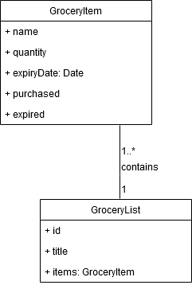

# BTS530 Iteration 1
# Activity Diagrams

## View List Details

The following swimlane activity diagram demonstrates the process of the system rendering a grocery list for the user to see. It also covers the process of the system loading up the details page when the user taps on an item in the list.

# Database Design

The grocery app will have the following classes for this iteration:

## GroceryItem

* **Name** (String) - The name of the grocery item. (eg. carrots, tomatoes, pork chops, Coca-Cola, etc...)
* **Expiry Date** (Date) - The expiry date of the item (eg. 2019-04-15)
* **Quantity** (Integer) - The amount of said item that the user has bought. (eg. 10 carrots)
* **Purchased** (Boolean) - This is a field that a user can toggle to check off an item that they already bought on the list. (eg. True = item already purchased, False = item not yet purchased)

## GroceryList
* **Id** (Generated value) - the unique identifier value for a list.
* **Title** (String) - the user inputted title for the name of the list.
* **Items** (GroceryItem class instance) - items in the list.

# Domain Model
