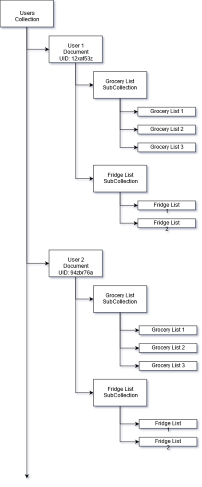
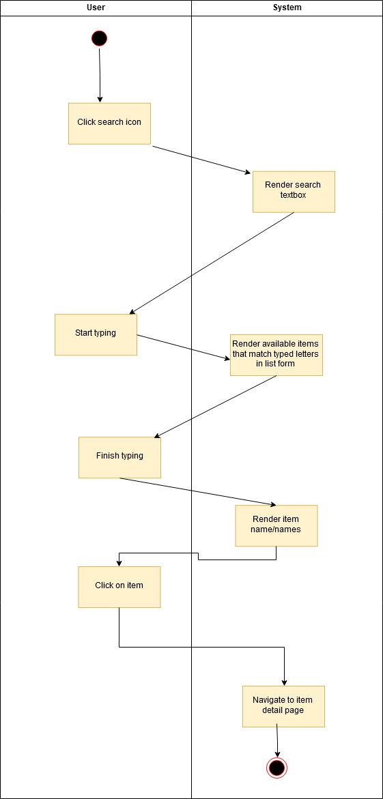
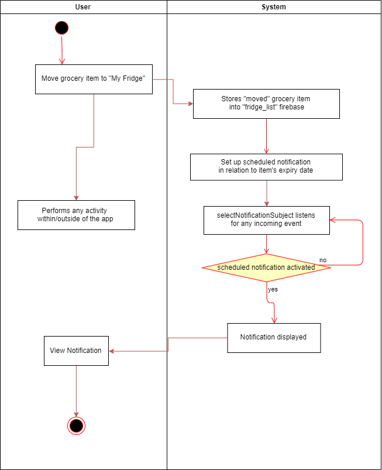

# BTS530 Iteration 4

## Multiple Grocery Lists Research

From research of Google's [Cloud Firestore](https://cloud.google.com/firestore/ "Firestore Homepage"), we are planning on redesigning the database based on the user authentication UID (User Identification) value. The UID value is a unique hash code generated to identify a user in the system.

When a user logs in, their UID will be used to fetch their lists from the Cloud Firestore database.

## Activity Diagram

### Search

### View Notification

### Move Item to Fridge
### Actors
* User

### Trigger
User swipes on the grocery item.
### Pre-Condition
User is on the grocery list page.
### Post-Condition
Item is removed from grocery list and added in fridge list.
### Normal Flow
1. User swipes right on a grocery item.
2. System removes item from grocery list and updates the database.
3. System adds the item to the fridge list.
4. System shows a notification that the item has been moved.

### Sort Items
### Actors
* User

### Trigger
User taps on triple dots button on top right corner.

### Pre-Condition
User is logged in and is on the main page.

### Post-Condition
Items are sorted based on the user's preference.

### Normal Flow
1. User taps on the triple dot button on the top right corner and selects a sorting option.
2. System sorts all the items based on the selected option and displays it.